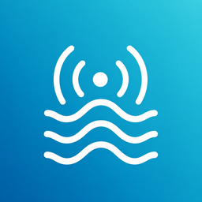

<div align="center">
  
  <h1>BTHome Coast</h1>
  <p>一个现代、沉浸式的 Android / Windows BTHome v2 BLE 广播调试器。</p>

  [](https://github.com/applenana/BTHome_Coast/actions/workflows/ci.yml)
  [](https://github.com/applenana/BTHome_Coast/actions/workflows/release.yml)
  [](https://flutter.dev/)
  [](#运行环境)
  [](LICENSE)
</div>

## 简介

BTHome Coast 被设计为一个轻量的现场调试工具：它被动扫描周围 UUID 为 `0xFCD2` 的 BTHome v2 Service Data，不连接设备，并实时展示 RSSI、接收次数、Device Information、测量对象、告警状态和原始十六进制数据。

应用面向 Android 真机和 Windows 10/11，使用统一的解析器与蓝白海岸风格界面。扫描期间，多层海浪会持续波动，并以极低音量播放本项目原创的海浪环境声；声音可以随时关闭。

## 功能

- 被动扫描 BTHome v2 广播，不连接或控制周围设备
- 解析数值、二进制传感器、按钮、命令、旋钮、文本、Raw、时间戳和版本对象
- 正确处理小端数据、有符号数、缩放因子和重复对象
- 醒目标记高温、低温、烟雾、水浸及其他安全告警
- 按设备名称或地址搜索，并按全部、警报、加密广播筛选
- 展示 RSSI、接收次数、触发模式、协议版本和原始 Service Data
- 一键复制原始广播数据，方便与固件日志进行比对
- Android 单栏与 Windows 列表/详情双栏自适应布局
- 平滑的状态、按钮、计数和海浪动画，支持系统“减少动态效果”设置
- 扫描时循环播放 5.5% 音量的原创海浪环境声，可立即静音
- Android 自适应/单色图标与 Windows 多尺寸圆角图标

## BTHome 支持范围

解析器依据 [BTHome v2 Format](https://bthome.io/format/) 实现，并只处理 `0xFCD2` Service Data。

| 能力 | 状态 |
| --- | --- |
| 未加密 BTHome v2 | 完整解析已支持的标准对象 |
| 加密 BTHome v2 | 识别加密标记并展示密文，不保存或猜测设备密钥 |
| 同一类型重复对象 | 支持，自动生成稳定的重复键名 |
| 未知或截断对象 | 安全停止解析并展示问题位置 |
| BTHome v1 | 不支持 |

## 获取构建产物

每次推送到 `main` 或提交 Pull Request 时，[GitHub Actions](https://github.com/applenana/BTHome_Coast/actions/workflows/ci.yml) 会执行静态分析、自动化测试，并生成：

- `BTHome-Coast-Android`：包含 ARM64、32 位 ARM 和 x86_64 三个 APK
- `BTHome-Coast-Windows-x64`：包含 `BTHome_Coast.exe`、Flutter DLL、BLE/音频插件和数据文件的完整 ZIP

Windows 用户必须解压完整 ZIP 后运行 `BTHome_Coast.exe`，不能只复制 EXE。CI 生成的 APK 使用调试签名，仅用于安装测试；发布到应用商店前应配置正式签名。

### 标签自动发版

向 GitHub 推送三段式版本标签会自动创建 [GitHub Release](https://github.com/applenana/BTHome_Coast/releases)：

```powershell
git tag -a v1.2.0 -m "BTHome Coast v1.2.0"
git push origin v1.2.0
```

标签必须严格使用 `vX.Y.Z` 格式。`.github/workflows/release.yml` 会先执行格式、静态分析与测试，通过后发布：

- Android：`arm64-v8a`、`armeabi-v7a`、`x86_64` 和 `universal` 四个 APK
- Windows：完整便携版 ZIP 和带卸载入口、开始菜单快捷方式的 Inno Setup 安装包
- `SHA256SUMS.txt`：全部安装包的 SHA-256 校验值
- Release 正文：上一个可达版本标签到当前标签之间的完整 Commit 日志和 Compare 链接

GitHub 自动构建的 Android APK 使用项目当前的调试签名，适合直接侧载；Windows 安装包未进行商业代码签名，首次运行时 Windows 可能显示信誉提示。应用商店或正式商业分发前，应改用私有签名证书。

### Android ABI 选择

| 文件后缀 | 适用设备 |
| --- | --- |
| `arm64-v8a` | 大多数现代 Android 手机，推荐 |
| `armeabi-v7a` | 较旧的 32 位 ARM 设备 |
| `x86_64` | Android 模拟器或少量 x86_64 设备 |
| `universal` | 同时包含以上架构，兼容性最高但体积较大 |

## 运行环境

- Flutter `3.41.9`
- Dart `3.11` 或更高版本
- Android 7.0（API 24）或更高版本，且设备支持 BLE
- Windows 10/11 x64，且电脑支持 Bluetooth Low Energy
- 构建 Windows 时需要 Visual Studio 的“使用 C++ 的桌面开发”工作负载

## 从源码运行

```powershell
git clone https://github.com/applenana/BTHome_Coast.git
cd BTHome_Coast
flutter pub get
flutter analyze
flutter test
```

运行 Android：

```powershell
flutter run -d <android-device-id>
```

运行 Windows：

```powershell
flutter run -d windows
```

构建 Release：

```powershell
flutter build apk --release --split-per-abi
flutter build windows --release
```

## 权限与隐私

- 应用只进行 BLE 广播扫描，不主动连接发现的设备
- 应用没有网络请求、遥测、账号、云同步或广告 SDK
- 广播数据只保存在进程内存中；关闭应用后不会落盘
- 原始广播只会在用户主动点击复制按钮时进入系统剪贴板
- 环境声音是随应用打包的本地 WAV，不会访问网络
- Android 12 及以上请求“附近设备”权限
- Android 11 及以下受系统 BLE 限制，需要定位权限，但应用不会请求或读取位置
- Windows 不调用插件不支持的 `authorize()`，直接使用系统 BLE 状态开始扫描

## 沉浸式体验

海浪环境声位于 `assets/audio/gentle_shore.wav`，由 `tool/generate_assets.py` 确定性生成，不包含第三方录音。它只会在扫描期间播放，默认音量为 5.5%；点击扫描按钮旁的音量图标即可关闭或恢复。

图标母版、Android 图标、Windows ICO 和环境声都可以通过以下命令重新生成：

```powershell
python tool/generate_assets.py
```

脚本需要 Python 3 和 Pillow。

## 项目结构

```text
lib/
├── audio/       # 海浪环境声播放与状态控制
├── bthome/      # BTHome v2 数据模型和解析器
├── scanner/     # BLE 平台适配与扫描状态管理
└── ui/          # 海岸主题、动画和响应式界面
assets/          # 原创图标与环境声音
android/         # Android 平台工程与权限配置
windows/         # Windows Runner、图标与插件注册
packaging/       # Windows Inno Setup 安装包定义
test/            # 协议、控制器和界面测试
tool/            # 可重复生成资产的脚本
```

## 持续集成

`.github/workflows/ci.yml` 在 Ubuntu 和 Windows GitHub 托管运行器上完成：

1. 格式检查、`flutter analyze` 和全部自动化测试
2. Android 三 ABI Release APK 构建
3. Windows x64 Release 构建、便携目录压缩和 Inno Setup 安装包烟雾编译
4. 将双平台成品上传为 Workflow Artifacts

工作流中的第三方 Actions 均锁定到完整提交 SHA，降低供应链漂移风险。

`.github/workflows/release.yml` 只在推送 `vX.Y.Z` 标签时运行；它复用同一质量门，构建六个发行包，计算校验值，并在全部平台成功后原子化创建 GitHub Release。任一测试、构建或打包步骤失败时都不会发布不完整 Release。

## 参与贡献

欢迎提交 Issue 或 Pull Request。提交前请确保：

```powershell
dart format --output=none --set-exit-if-changed lib test
flutter analyze
flutter test
```

如果新增 BTHome 对象，请同时添加解析器测试；如果调整响应式界面，请至少验证 Windows 桌面尺寸和 `390 × 800` Android 视口。

## English summary

BTHome Coast is an open-source Flutter inspector for passively examining nearby BTHome v2 BLE advertisements on Android and Windows. It decodes unencrypted `0xFCD2` Service Data, highlights alarms, displays raw packets, and includes responsive coastal visuals with optional locally bundled ocean ambience. The app does not connect to devices, send telemetry, or persist scanned advertisements.

## 许可证与致谢

本项目使用 [MIT License](LICENSE)。

- 协议：[BTHome v2 Format](https://bthome.io/format/)
- BLE：[bluetooth_low_energy](https://pub.dev/packages/bluetooth_low_energy)（MIT）
- 音频：[audioplayers](https://pub.dev/packages/audioplayers)（MIT）
- UI 框架：[Flutter](https://flutter.dev/)
